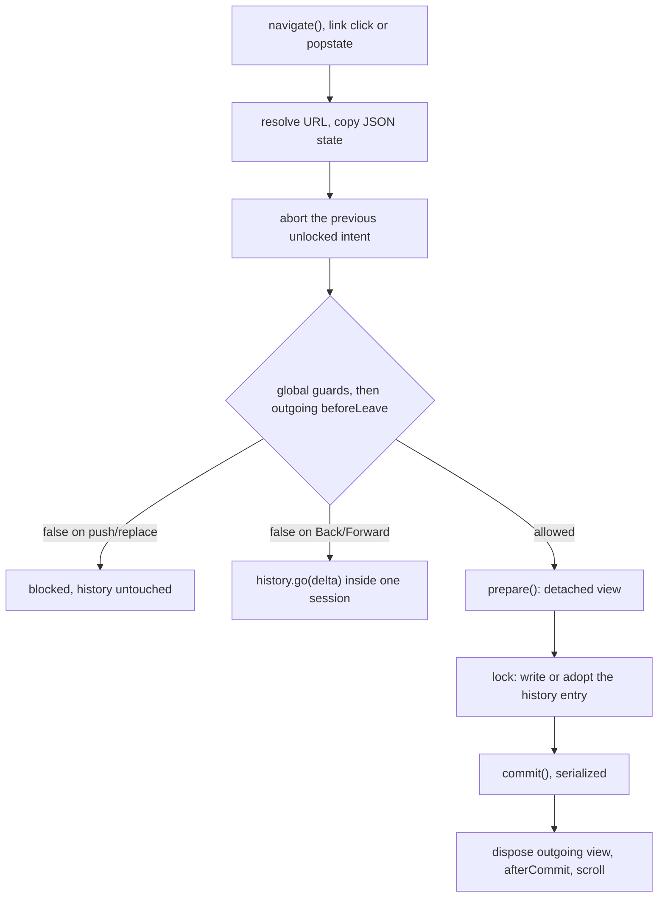

# Architecture: defuss-dom-router

This package turns URLs into immutable route requests and orders navigation intents against the browser's real History API. It owns URL parsing, route matching, history ownership and the order in which views commit. It deliberately does not render, fetch data, manage application state or talk to native hosts: rendering enters through the `prepare`/`commit` callbacks, and a native shell delivers links by calling `navigate()` with `cause: 'native'`.

## Why this design

- **Injected rendering instead of a bundled renderer.** The router imports only its own modules (`tools/policy.py` rejects any non-local import in `src/` and any runtime or peer dependency in `package.json`). The same core therefore serves native DOM, defuss-query, defuss-morph and shadcn's embedded `df$` without loading a second rendering engine.
- **Prepare, then commit.** Application work that may be superseded (fetches, detached DOM) runs in `prepare(context)` with an `AbortSignal`; only `commit()` touches the live page. A newer intent can therefore abandon an older one before anything visible changes, and the abandoned view is disposed instead of committed. Once a commit starts it is serialized and never interrupted, because arbitrary JavaScript cannot be cancelled or rolled back.
- **Guards before history writes.** For `navigate()` and link clicks, guards run before `pushState`/`replaceState`, so a veto leaves history untouched. Back/Forward cannot be vetoed before the browser moves, so the router corrects them afterwards with `history.go(delta)`. That correction needs reliable indexes, which is why the router keeps its own per-entry metadata instead of trusting the URL alone.
- **Tests run the shipped bundle.** Node tests, the packed-tarball consumer and the browser suite all load `dist/`, not `src/`. Only `tmp/units/`, a test-only bundle of internal modules, reaches `BrowserHistory` and `bindLinks` directly. The coordinator needs a real Window, which Node does not have and which this project does not fake, so `make coverage` merges Node's V8 coverage of `dist/index.js` with Chromium's coverage of the same file from the browser suite.
- **One owner per Window.** Two routers writing the same session history would corrupt each other's indexes. `BrowserHistory` marks the Window with a private symbol and a second router fails with `already-owned` until the first calls `destroy()`.

## How it works

Modules form a strict layering; each imports only from rows above it:

| Layer | Modules | Responsibility |
| --- | --- | --- |
| Values | `errors`, `state` | Typed input errors; deep-copied, frozen JSON state with cross-realm plain-object checks |
| Pure URL logic | `matcher`, `url` | Compile route patterns once; resolve hrefs in history or hash mode under `basePath`; build named hrefs |
| Browser adapters | `history`, `links` | `BrowserHistory` is the only history writer; `bindLinks` is one delegated click listener |
| Coordinator | `router` | Intent ordering, guards, prepare/commit, snapshots and subscriptions |

URL resolution needs no Window: `resolve()` and `href()` work from `baseUrl` alone, which is what the Node tests exercise.

A controlled navigation follows this path:

**Intent ordering.** At most one intent is active and at most one is queued. A new intent aborts an unlocked active intent (status `superseded`). Once the active intent locks (history written, commit started), new intents queue; a later intent replaces the queued one, so the latest queued intent wins. After each `await` the coordinator checks that its intent is still current, which also covers subscribers that start a new navigation from inside a snapshot callback.

**History metadata.** Each owned entry stores `{ session, index, key, href, state, scroll }` under `__defuss_dom_router_v1` and keeps any foreign fields of `history.state`. A push derives its index from the entry the browser is physically showing, not from the last committed view, because a superseded traversal may have moved the browser in between. A push from an entry the router does not own (for example after a native `location.hash` assignment) starts a new session. `restore()` only corrects within one session, so it never computes a `go(delta)` across a foreign entry and lands somewhere unrelated. If the correction is impossible or does not arrive within 3 seconds, the router reports `unowned-history` and does not commit the protected content.

**Paired events.** A fragment traversal can fire both `popstate` and `hashchange`. The coordinator ignores the second event when it describes the same entry as the active traversal, and ignores the event produced by its own corrective `go(delta)`.

**Links.** `attachLinks()` installs one delegated listener per root. It only intercepts primary, unmodified clicks on matching `<a href>` elements that target the same frame, are not downloads, do not carry `rel="external"` or an ancestor `data-router-ignore`, resolve inside the origin and base, and match a route. Before `start()` every link stays a native navigation.

## Operations

- **Configuration and policy:** `createRouter()` validates routes, mode, `basePath`, `baseUrl` and the scroll policy synchronously and copies the configuration. Afterwards only callbacks (`prepare`, `afterCommit`, `onError`) can change, through `config()`; new routes or a new mode require a new router.
- **Deployment and scaling:** pkgroll builds one self-contained ESM file (`dist/index.js`), a CommonJS twin (`dist/index.cjs`) and declarations. Because the ESM file imports nothing, the same file serves bundlers and plain `<script type="module">` use. `make metrics` prints the measured sizes; `tools/policy.py` fails lint when `dist/index.js` imports another module or exceeds 14,000 gzip bytes.
- **Complexity and resources:** patterns compile to regular expressions once at construction. Matching scans routes in registration order and stops at the first match, so it is linear in the number of routes. Per Window the router keeps one owner marker, one click listener per attached root, `popstate`/`hashchange`/passive `scroll` listeners and a map of saved scroll positions per entry key.
- **Reliability and SRE:** failures settle as values, never as unhandled rejections: `navigate()` resolves to `committed`, `unchanged`, `blocked`, `superseded`, `rejected` or `error` (with `commitStarted`). A failed commit is reported as an error, not rolled back. A callback that never settles holds the commit slot; the router cannot terminate it.
- **Observability:** the package writes no logs. `getSnapshot()`/`subscribe()` expose the phase (`idle`, `preparing`, `committing`, `error`, `destroyed`), the pending and current request, the intent ID and history ownership. `onError` receives typed, serializable `{ code, message }` diagnostics.

## Security and privacy

- **Inputs from outside:** URLs from links, `navigate()` and History events. Resolution accepts only HTTP(S) URLs without credentials and rejects targets outside the Window origin, the configured base or the hash-mode shell. Link interception ignores non-HTTP(S) schemes and leaves them to the browser. History state must be finite JSON; functions, host objects, cycles, accessors and sparse arrays are rejected before any history write.
- **Rendering boundary:** the router itself contains no HTML sinks (`innerHTML`, `eval` or similar); what reaches the page is decided by the application's `commit()`.
- **Native links:** a link delivered by a native shell is an ordinary `navigate()` call. It passes the same resolution, origin checks and guards as any other URL and gains no extra privilege.
- **Secrets:** none are handled. Diagnostics carry a code and fixed text, never the offending URL; an exception thrown by an application callback or the browser is reported with a fixed message instead of its own text. Applications should not log credentials or full native-link queries from their own callbacks.
- **Personal data:** the library processes no personal data of its own. Whatever the application passes as navigation `state` is stored by the browser in that tab's session history entry, together with the URL; the application decides whether that contains personal data and is responsible for its legal basis.
